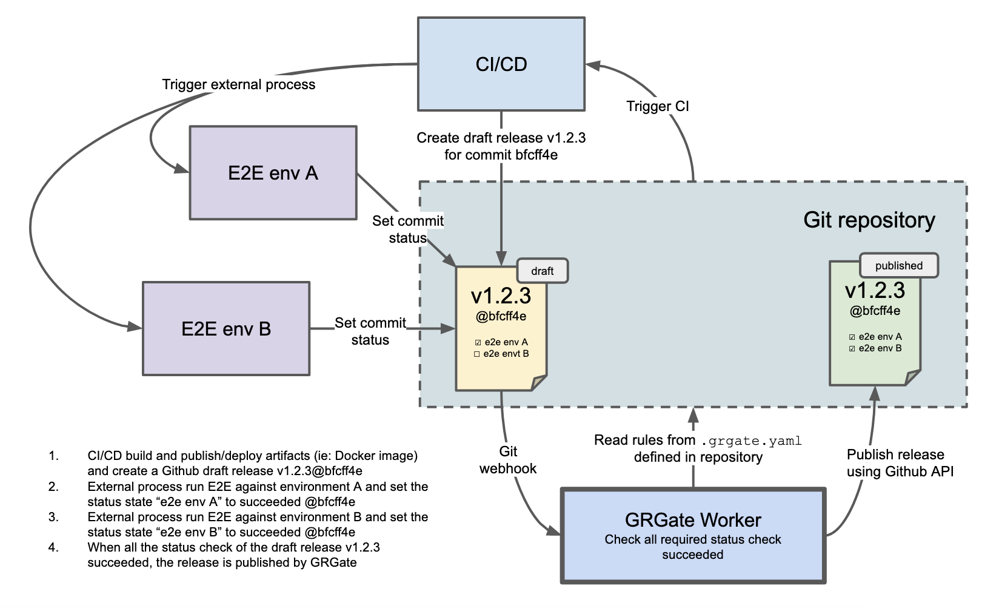

## Overview

GRGate is a CLI which can run a server and listen to Git webhook. When a
release is published as draft, GRGate wait for all status checks attached to
the commit target of the release to succeed before merging it.

The list of required statuses to succeed is defined in a `.grgate.yaml` config
file stored at the root of the repository.

The following diagram represent a concret example where a CI/CD process
generate/publish versionned artifacts and generate a draft release. Artifacts
are then deployed by a third party to different environments running with
different config. End-to-end tests are then run against these 2 environments
and reports result to the draft release as commit status. When all tests pass,
GRGate publish the GitHub release.

## Unpublished releases terminology

Different terminology is used by different provider:

- **GitHub** uses the term [draft releases][draft-release] to prepare a release
without publishing it.
- **GitLab** uses the term [upcoming releases][upcoming-release], it is similar
to GitHub Pre-releases where a badge notify the upcoming release in the GitLab
release page.  The attribute `released_at` should be set to a future date to
have it enabled and it is only possible to change it using the GitLab API.

[draft-release]: https://docs.github.com/en/github/administering-a-repository/managing-releases-in-a-repository#about-release-management
[upcoming-release]: https://docs.gitlab.com/ee/api/releases/#upcoming-releases
