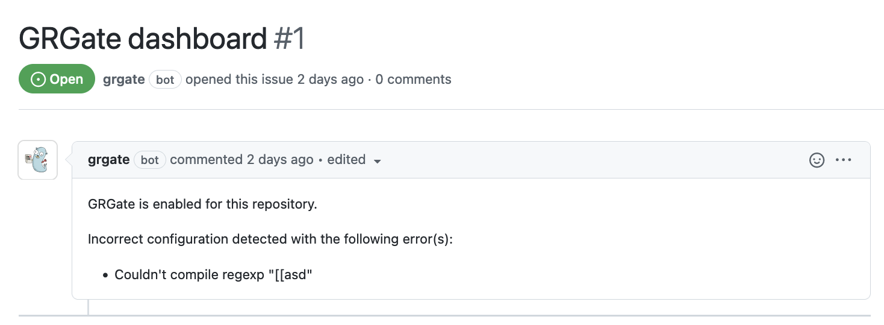

## Overview

GRGate is a CLI which can run a server and listen to Git webhook. When a
release is published as draft, GRGate wait for all status checks attached to
the commit target of the release to succeed before merging it.

The list of required statuses to succeed is defined in a `.grgate.yaml` config
file stored at the root of the repository.

The following diagram represent a concret example where a CI/CD process
generate/publish versionned artifacts and generate a draft release. Artifacts
are then deployed by a third party to different environments running with
different config. End-to-end tests are then run against these 2 environments
and reports result to the draft release as commit status. When all tests pass,
GRGate publish the GitHub release.

## Append commit statuses to release notes

GRGate can update existing release notes with the current state of the release.
Meaning, the release note will be updated with the list of commit status and
their state. When all status succeeded, the release is published.

## Issue dashboard

GRGate create an issue in the repository which is used as dashboard. It
provides feedback to the user when there is mis-configuration detected.

